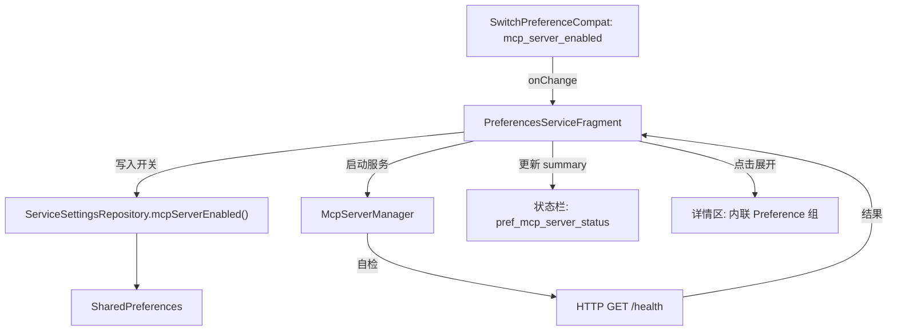

# MCP Server 开关持久化与状态自检

Feature Name: mcp-server-toggle-and-status
Updated: 2026-07-29

## Description

为 LogFox MCP Server 设置页面增加开关持久化能力，关闭时折叠隐藏所有子项，开启时自动启动并自检，状态栏支持点击展开详细信息。

## 涉及模块

| 模块 | 影响 |
|------|------|
| `feature/preferences/api` | `ServiceSettingsRepository` 新增 `mcpServerEnabled()` |
| `feature/preferences/impl` | `ServiceSettingsLocalDataSource` + Impl 新增 `mcpServerEnabled()` |
| `mcp/api` | `McpServerManager` 新增 `toolsCount` 属性 |
| `mcp/impl` | `McpServerManagerImpl` 暴露 `toolsCount` |
| `feature/preferences/presentation` | `PreferencesServiceFragment` 重构 MCP UI 逻辑 |

## Architecture



## Components and Interfaces

### 1. 数据层变更

#### ServiceSettingsLocalDataSource (interface)

新增方法：

```kotlin
fun mcpServerEnabled(): Preference<Boolean>
```

#### ServiceSettingsLocalDataSourceImpl

新增实现：

```kotlin
override fun mcpServerEnabled(): Preference<Boolean> = booleanPreference(
    key = KEY_MCP_SERVER_ENABLED,
    defaultValue = false,
)

// companion object 新增
const val KEY_MCP_SERVER_ENABLED = "pref_mcp_server_enabled"
```

#### ServiceSettingsRepository (interface)

新增方法：

```kotlin
fun mcpServerEnabled(): PreferenceStateFlow<Boolean>
```

#### ServiceSettingsRepositoryImpl

新增代理实现：

```kotlin
override fun mcpServerEnabled(): PreferenceStateFlow<Boolean> =
    localDataSource.mcpServerEnabled().asPreferenceStateFlow()
```

### 2. MCP API 层变更

#### McpServerManager (interface)

新增属性，用于状态详情展示：

```kotlin
val toolsCount: Int
```

#### McpServerManagerImpl

实现 `toolsCount`：

```kotlin
override val toolsCount: Int
    get() = tools.size
```

### 3. UI 层变更

#### settings_service.xml

新增内联详情 Preference（默认 hidden）：

```xml
<Preference
    android:title="@string/mcp_server_detail_port"
    android:key="pref_mcp_server_detail_port"
    android:selectable="false"
    app:isPreferenceVisible="false"
    app:iconSpaceReserved="false" />

<Preference
    android:title="@string/mcp_server_detail_host"
    android:key="pref_mcp_server_detail_host"
    android:selectable="false"
    app:isPreferenceVisible="false"
    app:iconSpaceReserved="false" />

<Preference
    android:title="@string/mcp_server_detail_auth"
    android:key="pref_mcp_server_detail_auth"
    android:selectable="false"
    app:isPreferenceVisible="false"
    app:iconSpaceReserved="false" />

<Preference
    android:title="@string/mcp_server_detail_tools"
    android:key="pref_mcp_server_detail_tools"
    android:selectable="false"
    app:isPreferenceVisible="false"
    app:iconSpaceReserved="false" />
```

状态 Preference 改为可点击，作为展开/折叠触发器：

```xml
<!-- selectable 从 false 改为 true -->
<Preference
    android:title="@string/mcp_server_status"
    android:key="pref_mcp_server_status"
    android:selectable="true"
    app:iconSpaceReserved="false" />
```

#### PreferencesServiceFragment

核心重构点：

```kotlin
// === 开关处理 ===
findPreference<SwitchPreferenceCompat>("pref_mcp_server_enabled")?.apply {
    // 从持久化读取初始状态
    isChecked = serviceSettingsRepository.mcpServerEnabled().value

    setOnPreferenceChangeListener { _, newValue ->
        val enabled = newValue as Boolean
        if (enabled) {
            // 开启：持久化 + 启动服务
            serviceSettingsRepository.mcpServerEnabled().set(true)
            startMcpServer()
            updateMcpUiVisibility(true)
        } else {
            // 关闭：弹出确认对话框
            showMcpDisableConfirmDialog()
            false  // 阻止 switch 立即切换，等确认后再切换
        }
    }
}

// === 状态栏点击展开/折叠 ===
private var detailExpanded = false
findPreference<Preference>("pref_mcp_server_status")?.setOnPreferenceClickListener {
    detailExpanded = !detailExpanded
    toggleDetailPreferences(detailExpanded)
    true
}
```

### 4. 自检流程

```
startMcpServer()
  ├── startForegroundService(intent)
  ├── delay(500ms)  // 等待服务启动
  ├── HTTP GET http://127.0.0.1:{port}/health
  ├── 200 OK → updateStatus("Running on port {port}")
  ├── Exception/非200 → updateStatus("Failed to start")
  └── updateStatus() 同步更新展开详情各字段
```

自检逻辑位于 Fragment 中，使用 `lifecycleScope.launch(Dispatchers.IO)` 异步执行，切换回主线程更新 UI。

## Data Models

### MCP UI 可见性状态管理

Fragment 内维护 `preference` 引用列表，批量控制可见性：

```kotlin
private val mcpSubPreferences by lazy {
    listOf(
        "pref_mcp_server_status",
        "pref_mcp_server_port",
        "pref_mcp_server_host",
        "pref_mcp_server_start",
        "pref_mcp_server_stop",
        // 详情 pref 初始不可见，展开时才显示
        "pref_mcp_server_detail_port",
        "pref_mcp_server_detail_host",
        "pref_mcp_server_detail_auth",
        "pref_mcp_server_detail_tools",
    )
}

private fun updateMcpUiVisibility(visible: Boolean) {
    mcpSubPreferences.forEach { key ->
        findPreference<Preference>(key)?.isVisible = visible
    }
    if (!visible) {
        detailExpanded = false
        toggleDetailPreferences(false)
        // 重置状态栏
        findPreference<Preference>("pref_mcp_server_status")?.summary = ""
    }
}

private fun toggleDetailPreferences(expanded: Boolean) {
    listOf(
        "pref_mcp_server_detail_port",
        "pref_mcp_server_detail_host",
        "pref_mcp_server_detail_auth",
        "pref_mcp_server_detail_tools",
    ).forEach { key ->
        findPreference<Preference>(key)?.isVisible = expanded
    }
}
```

### 新增字符串资源

```xml
<!-- 英文 -->
<string name="mcp_server_detail_port">Port</string>
<string name="mcp_server_detail_host">Bind address</string>
<string name="mcp_server_detail_auth">Authentication</string>
<string name="mcp_server_detail_tools">Available tools</string>
<string name="mcp_server_auth_enabled">Enabled</string>
<string name="mcp_server_auth_disabled">Disabled</string>
<string name="mcp_server_status_checking">Checking...</string>
<string name="mcp_server_status_failed">Startup failed</string>
<string name="mcp_server_disable_confirm_title">Disable MCP Server</string>
<string name="mcp_server_disable_confirm_message">Disabling will stop AI integration features. Continue?</string>

<!-- 中文 -->
<string name="mcp_server_detail_port">端口</string>
<string name="mcp_server_detail_host">绑定地址</string>
<string name="mcp_server_detail_auth">认证状态</string>
<string name="mcp_server_detail_tools">可用工具</string>
<string name="mcp_server_auth_enabled">已启用</string>
<string name="mcp_server_auth_disabled">已关闭</string>
<string name="mcp_server_status_checking">检查中...</string>
<string name="mcp_server_status_failed">启动失败</string>
<string name="mcp_server_disable_confirm_title">关闭 MCP 服务器</string>
<string name="mcp_server_disable_confirm_message">关闭将停止 AI 集成功能，确定继续？</string>
```

## 自检 HTTP 请求实现

Fragment 中使用 OkHttp 或 `java.net.HttpURLConnection` 发起本地自检：

```kotlin
private suspend fun performHealthCheck(port: Int) = withContext(Dispatchers.IO) {
    try {
        val url = java.net.URL("http://127.0.0.1:$port/health")
        val connection = url.openConnection() as java.net.HttpURLConnection
        connection.connectTimeout = 2000
        connection.readTimeout = 2000
        connection.requestMethod = "GET"
        val code = connection.responseCode
        connection.disconnect()
        code == 200
    } catch (e: Exception) {
        false
    }
}
```

## 关闭确认对话框

```kotlin
private fun showMcpDisableConfirmDialog() {
    MaterialAlertDialogBuilder(requireContext())
        .setTitle(Strings.mcp_server_disable_confirm_title)
        .setMessage(Strings.mcp_server_disable_confirm_message)
        .setPositiveButton(Strings.yes) { _, _ ->
            serviceSettingsRepository.mcpServerEnabled().set(false)
            stopMcpServer()
            updateMcpUiVisibility(false)
            findPreference<SwitchPreferenceCompat>("pref_mcp_server_enabled")?.isChecked = false
        }
        .setNegativeButton(Strings.no, null)
        .show()
}
```

## Starting State

Fragment 初始化时根据持久化状态决定 MCP UI 的可见性：

```kotlin
override fun onCreatePreferences(savedInstanceState: Bundle?, rootKey: String?) {
    addPreferencesFromResource(R.xml.settings_service)

    val mcpEnabled = serviceSettingsRepository.mcpServerEnabled().value

    // 初始化开关状态
    findPreference<SwitchPreferenceCompat>("pref_mcp_server_enabled")?.isChecked = mcpEnabled

    // 初始化 UI 可见性
    updateMcpUiVisibility(mcpEnabled)

    // 如果开关已开启，检查服务是否已在后台运行并更新状态
    if (mcpEnabled) {
        lifecycleScope.launch {
            // 检查 McpServerService 是否已在运行
            val manager = activity?.getSystemService(Context.ACTIVITY_SERVICE) as? android.app.ActivityManager
            val isRunning = manager?.runningAppProcesses?.any { it.processName.contains(":mcp") } == true
            if (isRunning) {
                val port = serviceSettingsRepository.mcpServerPort().value
                val healthy = performHealthCheck(port)
                updateStatusDisplay(healthy, port)
            }
        }
    }
}
```

## Correctness Properties

- 开关状态与 `isVisible` 严格一致：off → 子项 all hidden，on → 子项 all visible
- 详情展开状态在折叠 MCP UI 时自动重置为 false
- `stopMcpServer()` 前确保开关已持久化为 false，防止进程被杀后重启又恢复 on 状态
- 自检超时 2s，防止阻塞 UI
- 自检使用 `127.0.0.1` 地址，跳过网络权限问题

## Modified Files

| File | Change |
|------|--------|
| `feature/preferences/api/data/ServiceSettingsRepository.kt` | +`mcpServerEnabled()` |
| `feature/preferences/impl/data/service/ServiceSettingsLocalDataSource.kt` | +`mcpServerEnabled()` |
| `feature/preferences/impl/data/service/ServiceSettingsLocalDataSourceImpl.kt` | +实现 + key |
| `feature/preferences/impl/data/service/ServiceSettingsRepositoryImpl.kt` | +代理实现 |
| `mcp/api/McpServerManager.kt` | +`toolsCount` |
| `mcp/impl/McpServerManagerImpl.kt` | +`toolsCount` 实现 |
| `feature/preferences/presentation/res/xml/settings_service.xml` | +详情 pref ×4，状态栏 selectable=true |
| `feature/preferences/presentation/.../PreferencesServiceFragment.kt` | 重构 MCP UI 逻辑 |
| `strings/.../strings.xml` (en + zh-rCN) | +新字符串 |
